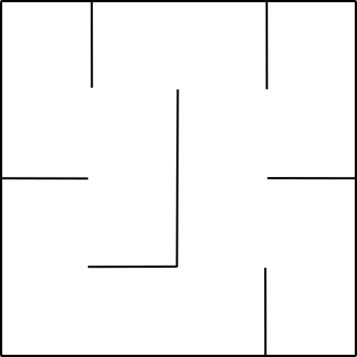

# Résolution d'un labyrinthe

## 1. Présentation du problème
Considérons le labyrinthe suivant :
{: .center width=35%}

Affectons une lettre à chaque case de ce labyrinthe.

{: .center width=35%}

Notre objectif est de trouver comment aller **de A en P**.


## 2. Modélisation par un graphe

Dessiner le graphe (dont les noeuds seront des lettres) qui modélise ce labyrinthe.

Proposer deux «formes» possibles pour ce graphe.

{{
correction(False,
"""
??? success \"Correction\" 
    {: .center width=35%}


    {: .center width=35%}    
"""
)
}}

    


## 3. Implémentation du graphe en Python

En utilisant la classe ```Graphe``` créée en cours, implémenter le graphe de ce labyrinthe.

{{
correction(False,
"""
??? success \"Correction\" 
    ```python linenums='1'
    class Graphe:
        def __init__(self, liste_sommets):
            self.liste_sommets = liste_sommets
            self.adjacents = {sommet : [] for sommet in liste_sommets}

        def ajoute_arete(self, sommetA, sommetB):
            self.adjacents[sommetA].append(sommetB)
            self.adjacents[sommetB].append(sommetA)

        def voisins(self, sommet):
            return self.adjacents[sommet]

        def sont_voisins(self, sommetA, sommetB):
            return sommetB in self.adjacents[sommetA]

    g = Graphe(['A', 'B', 'C', 'D', 'E', 'F', 'G', 'H', 'I', 'J', 'K', 'L', 'M', 'N', 'O', 'P'])
    g.ajoute_arete('A', 'E')
    g.ajoute_arete('E', 'F')
    g.ajoute_arete('F', 'B')
    g.ajoute_arete('B', 'C')
    g.ajoute_arete('C', 'G')
    g.ajoute_arete('G', 'H')
    g.ajoute_arete('H', 'D')
    g.ajoute_arete('G', 'K')
    g.ajoute_arete('F', 'J')
    g.ajoute_arete('J', 'I')
    g.ajoute_arete('I', 'M')
    g.ajoute_arete('M', 'N')
    g.ajoute_arete('N', 'O')
    g.ajoute_arete('O', 'K')
    g.ajoute_arete('K', 'L')
    g.ajoute_arete('L', 'P')
    ```    
"""
)
}}


## 4. Recherche du plus court chemin

En utilisant la fonction ```recherche_chemin``` du cours, établir le plus court chemin pour aller de A vers P dans ce labyrinthe.


{{
correction(False,
"""
??? success \"Correction\" 
    ```python linenums='1'
    def recherche_chemin(g, depart, arrivee):
        '''
        Parcours en largeur du graphe g en partant du sommet depart,
        qui s'arrête dès que le sommet arrivee est atteint.
        Renvoie alors le chemin du depart vers arrivee.
        '''
        traites = []
        decouverts = [depart]
        en_attente = [depart]
        parent = {}
        while en_attente != [] :
            sommet = en_attente.pop(0)
            voisins = g.voisins(sommet)
            for voisin in voisins:
                if voisin not in decouverts:
                    decouverts.append(voisin)
                    en_attente.append(voisin)
                    parent[voisin] = sommet
                    if voisin == arrivee:
                        return remonte_chemin(depart, arrivee, parent)
            traites.append(sommet)
        return 'non trouvé'  


    def remonte_chemin(depart, arrivee, parent):
        sommet = arrivee
        chemin = arrivee
        while sommet != depart:
            sommet = parent[sommet]
            chemin = sommet + chemin
        return chemin
    ```

    ```python
    >>> recherche_chemin(g, 'A', 'P')
    'AEFBCGKLP'
    ```    
"""
)
}}


## 5. Conclusion

Sur un labyrinthe un peu plus imposant, voici l'illustration de notre méthode de résolution :

<center>
<gif-player src="https://glassus.github.io/terminale_nsi/T1_Structures_de_donnees/1.4_Graphes/data/sol_laby.gif" speed="1" play></gif-player>
</center>


- le parcours en largeur part découvrir les cases dans toutes les directions.
- lorsque la case cherchée (ici, la rouge) est trouvée, on remonte à chaque case précédente grâce au dictionnaire ```parent```, et ainsi le chemin de sortie du labyrinthe est généré. 
 
[Code de cette animation](data/anim_laby.py){. target="_blank"} (en Pygame)


## 6. Annexe : et pourquoi pas en DFS ?

Les parcours BFS et DFS ont tous deux la propriété de parcourir **la totalité** du graphe (ils sont même conçus pour cela). Cela a permis au parcours BFS de nous fournir une solution au labyrinthe (dont on a démontré qu'elle était la plus courte).

Que penser de solution qui sera donnée par le DFS ?

### 6.1 Dans un labyrinthe parfait

Voici un code où la solution est d'abord recherchée par BFS (cases explorées en bleu clair, chemin trouvé marqué en bleu), puis en DFS (cases explorées en rose, chemin trouvé marqué en rouge).

[anim_laby_DFSvsBFS_laby_parfait.py](data/anim_laby_DFSvsBFS_laby_parfait.py) :arrow_down:

Que remarquez-vous ???


### 6.2 Dans un labyrinthe non parfait

Changeons de code pour un labyrinthe *dégénéré* :

[anim_laby_DFSvsBFS_laby_degenere.py](data/anim_laby_DFSvsBFS_laby_degenere.py) :arrow_down:

Que remarquez-vous ???


??? tip "Explications"
    Notre labyrinthe conçu de manière aléatoire possède une propriété remarquable (dû son algorithme de construction) : chaque case peut être reliée à une autre par **un chemin unique**. On dit de ces labyrinthes qu'ils sont **parfaits**.

    Donc, dans notre code du 6.1 (labyrinthe parfait), le DFS va lui aussi trouver le chemin le plus court... puisqu'il y en a qu'un seul ! De plus, la méthode d'exploration en profondeur va de plus rendre le DFS plus rapide que le BFS, quasiment tout le temps. Ce qui fait que pour un labyrinthe parfait, le DFS est plus intéressant que le BFS.


    Mais si le labyrinthe n'est plus parfait (code du 6.2), le DFS va trouver une solution qui ne sera pas obligatoirement la meilleure... S'il y a plusieurs solutions possibles, absolument rien ne garantit que la première solution trouvée par le DFS (sur laquelle il s'arrêtera) sera la meilleure !