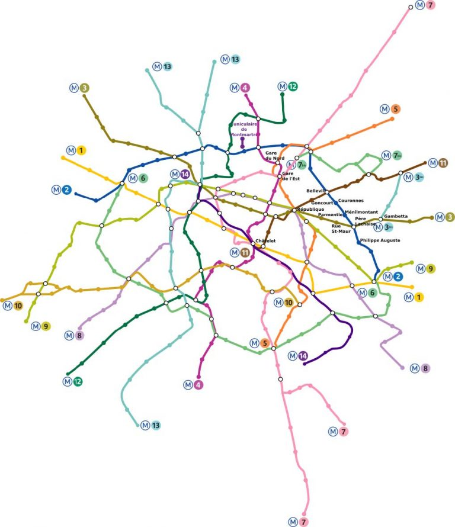
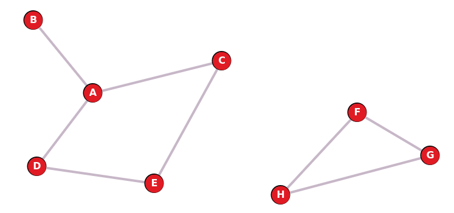
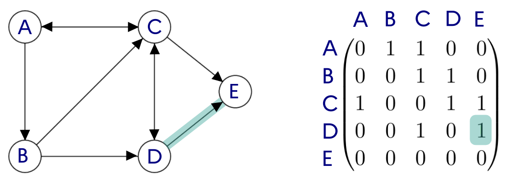
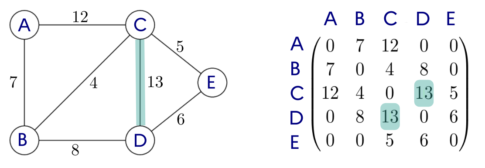
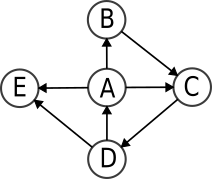
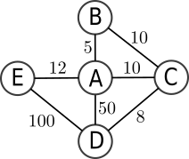
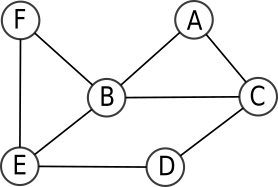

# Graphes

{: .center width=40%}


{: .center}

{: .center}

{{ initexo(0) }}

*Ce cours est intégralement inspiré du [cours de Cédric Gouygou](https://cgouygou.github.io/TNSI/T01_StructuresDonnees/T1.5_Graphes/T1.5.1_Graphes/){. target="_blank"} , du lycée Marguerite de Valois d'Angoulême (16)*

## 1. Notion de graphe et vocabulaire

Le concept de graphe permet de résoudre de nombreux problèmes en mathématiques comme en informatique. C'est un outil de représentation très courant, et nous l'avons déjà rencontré à plusieurs reprises, en particulier lors de l'étude de réseaux.


### 1.1 Exemples de situations
#### 1.1.1 Réseau informatique

{: .center width=40%} 

#### 1.1.2 Réseau de transport
{: .center width=60%} 

#### 1.1.3 Réseau social
{: .center width=40%} 

#### 1.1.4 Généralisation
Une multitude de problèmes concrets d'origines très diverses peuvent donner lieu à des modélisations par des graphes : c'est donc une structure essentielle en sciences, qui requiert un formalisme mathématique particulier que nous allons découvrir. 
{: .center} 

L'étude de la théorie des graphes est un champ très vaste des mathématiques : nous allons surtout nous intéresser à l'implémentation en Python d'un graphe et à différents problèmes algorithmiques qui se posent dans les graphes.


### 1.2 Vocabulaire
En général, un graphe est un ensemble d'objets, appelés *sommets* ou parfois *nœuds* (*vertex* or *nodes* en anglais) reliés par des *arêtes* ou *arcs* ((*edges* en anglais)).
Ce graphe peut être **non-orienté** ou **orienté** .

#### 1.2.1 Graphe non-orienté
{: .center width=480} 

Dans un graphe **non-orienté**, les *arêtes* peuvent être empruntées dans les deux sens, et une *chaîne* est une suite de sommets reliés par des arêtes, comme C - B - A - E par exemple. La *longueur* de cette chaîne est alors 3, soit le nombre d'arêtes.

Les sommets B et E sont *adjacents* au sommet A, ce sont les *voisins* de A.


**Exemple de graphe non-orienté** : le graphe des relations d'un individu sur Facebook est non-orienté, car si on est «ami» avec quelqu'un la réciproque est vraie.

#### 1.2.2 Graphe orienté

{: .center width=480} 

Dans un graphe **orienté**, les *arcs* ne peuvent être empruntés que dans le sens de la flèche, et un *chemin* est une suite de sommets reliés par des arcs, comme B → C → D → E par exemple.

Les sommets C et D sont *adjacents* au sommet B (mais pas A !), ce sont les *voisins* de B.

**Exemple de graphe orienté** : le graphe des relations d'un individu sur Twitter est orienté, car on peut «suivre» quelqu'un sans que cela soit réciproque.

#### 1.2.3 Graphe pondéré

{: .center width=480} 

Un graphe est **pondéré** (ou valué) si on attribue à chaque arête une valeur numérique (la plupart du temps positive), qu'on appelle *mesure*, *poids*, *coût* ou *valuation*.

Par exemple:

- dans le protocole OSPF, on pondère les liaisons entre routeurs par le coût;
- dans un réseau routier entre plusieurs villes, on pondère par les distances.


#### 1.2.4 Connexité

Un graphe est **connexe** s'il est d'un seul tenant: c'est-à-dire si n'importe quelle paire de sommets peut toujours être reliée par une chaîne. Autrement un graphe est connexe s'il est «en un seul morceau».

Par exemple, le graphe précédent est connexe. Mais le suivant ne l'est pas: il n'existe pas de chaîne entre les sommets A et F par exemple.

{: .center width=480} 

Il possède cependant deux **composantes connexes** : le sous-graphe composé des sommets A, B, C, D et E d'une part et le sous-graphe composé des sommets F, G et H.


## 2. Modélisations d'un graphe

Pour modéliser un graphe, il faut établir par convention une manière de donner les renseignements suivants :

- qui sont les sommets ?
- pour chaque sommet, quels sont ses voisins ? (et éventuellement quel poids porte l'arête qui les relie)


### 2.1 Représentation par matrice d'adjacence

!!! abstract "Principe"
    - On classe les sommets (en les numérotant, ou par ordre alphabétique).
    - on représente les arêtes (ou les arcs) dans une matrice, c'est-à-dire un tableau à deux dimensions où on inscrit un 1 en ligne `i` et colonne `j` si les sommets de rang `i` et de rang `j` sont **voisins** (dits aussi *adjacents*).

    Ce tableau s'appelle une **matrice d'adjacence** (on aurait très bien pu l'appeler aussi *matrice de voisinage*).


#### 2.1.1 Graphe non orienté

{: .center width=70%}


Dans ce graphe non orienté, comme B est voisin de C, C est aussi voisin de B, ce qui signifie que l'arête qui relie B et C va donner lieu à deux "1" dans la matrice, situé de part et d'autre de la diagonale descendante (un mathématicien parlera de matrice *symétrique*).


#### 2.1.2 Graphe orienté

{: .center width=70%}


#### 2.1.3 Graphe pondéré

{: .center width=75%}


#### 2.1.4 Exercices

!!! example "{{ exercice() }}"
    Soit un ensemble d'amis connectés sur un réseau social quelconque. Voici les interactions qu'on a recensées :

    - André est ami avec Béa, Charles, Estelle et Fabrice,
    - Béa est amie avec André, Charles, Denise et Héloïse,
    - Charles est ami avec André, Béa, Denise, Estelle, Fabrice et Gilbert,
    - Denise est amie avec Béa, Charles et Estelle,
    - Estelle est amie avec André, Charles et Denise,
    - Fabrice est ami avec André, Charles et Gilbert,
    - Gilbert est ami avec Charles et Fabrice,
    - Héloïse est amie avec Béa.
    
    **Q1.** Représenter le graphe des relations dans ce réseau social (on désignera chaque individu par l'initiale de son prénom). Il est possible de faire en sorte que les arêtes ne se croisent pas !

    ??? tip "Correction Q1"
        {: .center}
        
    **Q2.** Donner la matrice d'adjacence de ce graphe.

    ??? tip "Correction Q2"
        $\pmatrix{
        0 & 1 & 1 & 0 & 1 & 1 & 0 & 0 \\
        1 & 0 & 1 & 1 & 0 & 0 & 0 & 1 \\
        1 & 1 & 0 & 1 & 1 & 1 & 1 & 0 \\
        0 & 1 & 1 & 0 & 1 & 0 & 0 & 0 \\
        1 & 0 & 1 & 1 & 0 & 0 & 0 & 0 \\
        1 & 0 & 1 & 0 & 0 & 0 & 1 & 0 \\
        0 & 0 & 1 & 0 & 0 & 1 & 0 & 0 \\
        0 & 1 & 0 & 0 & 0 & 0 & 0 & 0 \\
        }$
        
        
!!! example "{{ exercice() }}"
    Construire les graphes correspondants aux matrices d'adjacence suivantes:

    **Q1.** $M_1 =\pmatrix{
        0&1&1&1&1\\
        1&0&1&0&0\\
        1&1&0&1&0\\
        1&0&1&0&1\\
        1&0&0&1&0\\
        }$

    ??? tip "Correction"
        {: .center}
        
    **Q2.** $M_2=\pmatrix{
        0&1&1&0&1\\
        0&0&1&0&0\\
        0&0&0&1&0\\
        1&0&0&0&1\\
        0&0&0&0&0\\
        }$
    
    ??? tip "Correction"
        {: .center}

    **Q3.** $M_3=\pmatrix{
        0&5&10&50&12\\
        5&0&10&0&0\\
        10&10&0&8&0\\
        50&0&8&0&100\\
        12&0&0&100&0\\
        }$    

    ??? tip "Correction"
        {: .center}


#### 2.1.5 Implémentation Python des matrices d'adjacence

!!! info "Matrices d'adjacence en Python"
    Une matrice se représente naturellement par une liste de listes.

    **Exemple:**
    La matrice $M_1 =\pmatrix{
        0&1&1&1&1\\
        1&0&1&0&0\\
        1&1&0&1&0\\
        1&0&1&0&1\\
        1&0&0&1&0\\
        }$, associée au graphe {: .center}

    sera représentée par la variable ```G``` suivante :

    ```python
    G = [[0, 1, 1, 1, 1],
          [1, 0, 1, 0, 0],
          [1, 1, 0, 1, 0],
          [1, 0, 1, 0, 1],
          [1, 0, 0, 1, 0]]
    ```

**Complexité en mémoire et temps d'accès :**

- Pour un graphe à $n$ sommets, la complexité en mémoire (appelée aussi *complexité spatiale*) de la représentation matricielle est en $O(n^2)$.

- Tester si un sommet est isolé (ou connaître ses voisins) est en $O(n)$ puisqu'il faut parcourir une ligne, mais tester si deux sommets sont adjacents (voisins) est en $O(1)$, c'est un simple accès au tableau.


La modélisation d'un graphe par sa matrice d'adjacence est loin d'être la seule manière de représenter un graphe : nous allons voir une autre modélisation, par **liste d'adjacence**.

### 2.2 Représentation par listes d'adjacence

!!! abstract "Principe"
    - On associe à chaque sommet sa liste des voisins (c'est-à-dire les sommets adjacents). On utilise pour cela un dictionnaire dont les clés sont les sommets et les valeurs les listes des voisins.

    - Dans le cas d'un graphe orienté on associe à chaque sommet la liste des *successeurs* (ou bien des *prédécesseurs*, au choix).

    Par exemple, le graphe {: .center} sera représenté par le dictionnaire :

    ```python linenums='1'
    G = {'A': ['B', 'C', 'D', 'E'],
         'B': ['A', 'C'],
         'C': ['A', 'B', 'D'],
         'D': ['A', 'C', 'E'],
         'E': ['A', 'D']
        }
    ```

**Complexité en mémoire et temps d'accès :**

- Pour un graphe à $n$ sommets et $m$ arêtes, la complexité spatiale de la représentation en liste d'adjacence est en $O(n+m)$. C'est beaucoup mieux qu'une matrice d'adjacence lorsque le graphe comporte peu d'arêtes (i.e. beaucoup de 0 dans la matrice, non stockés avec des listes).

- Tester si un sommet est isolé (ou connaître ses voisins) est en $O(1)$ puisqu'on y accède immédiatement, mais tester si deux sommets sont adjacents (voisins) est en $O(n)$ car il faut parcourir la liste.

#### 2.2.1 Exercices

!!! example "{{ exercice() }}"
    Construire les graphes correspondants aux listes d'adjacence suivantes.

    **Q1.** 
    ```python
    G1 = {
    'A': ['B', 'C'],
    'B': ['A', 'C', 'E', 'F'],
    'C': ['A', 'B', 'D'],
    'D': ['C', 'E'],
    'E': ['B', 'D', 'F'],
    'F': ['B', 'E']
         }
    ```
    ??? tip "Correction Q1"
        {: .center}


    **Q2.** 
    ```python
    G2 = {
    'A': ['B'],
    'B': ['C', 'E'],
    'C': ['B', 'D'],
    'D': [],
    'E': ['A']
         }

    ```
    ??? tip "Correction Q2"
        {: .center}


## 3. Création d'une classe ```Graphe```

### 3.1 Interface souhaitée

Nous voulons que le graphe {: .center} puisse être créé grâce aux instructions suivantes :

```python
>>> g = Graphe(['A', 'B', 'C', 'D', 'E'])
>>> g.ajoute_arete('A', 'B')
>>> g.ajoute_arete('A', 'C')
>>> g.ajoute_arete('A', 'D')
>>> g.ajoute_arete('A', 'E')
>>> g.ajoute_arete('B', 'C')
>>> g.ajoute_arete('C', 'D')
>>> g.ajoute_arete('D', 'E')
```

Nous souhaitons aussi pouvoir tester si deux sommets sont voisins avec la méthode ```sont_voisins``` :

```python
>>> g.sont_voisins('E', 'A')
True
>>> g.sont_voisins('E', 'B')
False
```

Enfin, nous voulons pouvoir obtenir facilement la liste de tous les voisins d'un sommet avec la méthode ```voisins```:
```python
>>> g.voisins('C')
['A', 'B', 'D']
``` 

### 3.2 Conseils d'implémentation

Dans cette partie, nous ne traiterons que des graphes **non-orientés**.

L'objet de type ```Graphe``` aura comme attributs :

- une liste ```liste_sommets``` (donnée en paramètre dans la liste ```liste_sommets```) 
- un dictionnaire ```adjacents```, où chaque sommet se verra attribuer une liste vide ```[]```.


### 3.3 Implémentation

??? abstract "Implémentation d'une classe ```Graphe``` "
    ```python linenums='1'
    class Graphe:
        def __init__(self, liste_sommets):
            self.liste_sommets = liste_sommets
            self.adjacents = {sommet : [] for sommet in liste_sommets}

        def ajoute_arete(self, sommetA, sommetB):
            if sommetA in self.liste_sommets and sommetB in self.liste_sommets:
                self.adjacents[sommetA].append(sommetB)
                self.adjacents[sommetB].append(sommetA)
            
        def voisins(self, sommet):
            return self.adjacents[sommet]

        def sont_voisins(self, sommetA, sommetB):
            return sommetB in self.adjacents[sommetA]
    ```

{#
!!! code "Classe `#!py Graphe`"
    Il s'agit maintenant d'écrire une classe `Graphe` dont l'implémentation sera faite par listes d'adjacence (plus pratique pour ce qu'on veut faire, à savoir récupérer les voisins d'un sommet) et le constructeur prendra en paramètre la liste des sommets et construit un dictionnaire dont les valeurs sont des listes vides.

    L'interface doit comporter les méthodes suivantes:

    - `#!py ajouter_sommets` : ajoute un sommet donné en paramètre;
    - `#!py ajouter_arete` : ajoute une arête entre deux sommets donnés en paramètres;
    - `#!py sommets` : renvoie la liste des sommets;
    - `#!py voisins` : renvoie la liste des voisins d'un sommet donné en paramètre;
    - `#!py ordre` : renvoie l'ordre du graphe (c'est-à-dire son nombre de sommets);
    - `#!py est_voisin` : renvoie un booléen déterminant si deux sommets donnés en paramètres sont voisins ou non.

??? check "Proposition de correction"
    ```python linenums='1'
    class Graphe:
        def __init__(self, liste_sommets):
            self.adj = {sommet: [] for sommet in liste_sommets}

        def sommets(self):
            return [s for s in self.adj.keys()]

        def ordre(self):
            return len(self.sommets())

        def voisins(self, s):
            return self.adj[s]

        def est_voisin(self, s1, s2):
            '''
            verifie s2 est un voisin de s1
            '''
            return s2 in self.adj[s1]

        def ajoute_sommet(self, sommet):
            if sommet not in self.adj:
                self.adj[sommet] = []

        def ajoute_arete(self, s1, s2):
            self.ajoute_sommet(s1)
            self.ajoute_sommet(s2)
            if not self.est_voisin(s1, s2):
                self.adj[s1].append(s2)
            if not self.est_voisin(s2, s1):
                self.adj[s2].append(s1)
    ```
    Et pour une classe représentant un graphe orienté... c'est la même sauf pour la méthode `#!py ajoute_arete` à renommer en `#!py ajoute_arc` et où il suffit d'enlever les deux dernières instructions !


{#

## 4. Exercices

!!! example "{{ exercice() }}"
    === "Énoncé" 
        Construire les représentations des graphes suivants:

        1. Par matrice d'adjacence.
        2. Par listes d'adjacence.

        {: .center width=240} 

        {: .center width=240} 

        {: .center width=240} 
    === "Correction" 
        {{ correction(False, 
        "
        "
        ) }}

!!! example "{{ exercice() }}"
    === "Énoncé" 
        1. Construire les graphes correspondants aux matrices d'adjacences suivantes:

            $M_1 =\pmatrix{
                0&1&1&1&1\\
                1&0&1&0&0\\
                1&1&0&1&0\\
                1&0&1&0&1\\
                1&0&0&1&0\\
                }$
            $M_2=\pmatrix{
                0&1&1&0&1\\
                0&0&1&0&0\\
                0&0&0&1&0\\
                1&0&0&0&1\\
                0&0&0&0&0\\
                }$
            $M_3=\pmatrix{
                0&5&10&50&12\\
                5&0&10&0&0\\
                10&10&0&8&0\\
                50&0&8&0&100\\
                12&0&0&100&0\\
                }$

        2. Donner les listes d'adjacence correspondant aux matrices d'adjacence précédentes.
    === "Correction" 
        {{ correction(False, 
        "
        "
        ) }}


!!! example "{{ exercice() }}"
    === "Énoncé" 

        1. Construire les graphes correspondants aux listes d'adjacences suivantes. Déterminer s'il s'agit d'un graphe orienté, non orienté, pondéré.

            ```python linenums='1'
            G1 = {
                'A': ['B', 'C'],
                'B': ['A', 'C', 'E', 'F'],
                'C': ['A', 'B', 'D'],
                'D': ['C', 'E'],
                'E': ['B', 'D', 'F'],
                'F': ['B', 'E']
                }

            G2 = {
                'A': ['B'],
                'B': ['C', 'E'],
                'C': ['B', 'D'],
                'D': [],
                'E': ['A']
                }

            G3 = {
                'A': ['B', 'C'],
                'B': ['A', 'B', 'D'],
                'C': ['A', 'F'],
                'D': ['B', 'C', 'F'],
                'E': ['G'],
                'F': ['C', 'F'],
                'G': ['E']
                }

            G4 = {
                'A': {'B' : 300, 'C' : 310, 'D' : 280},
                'B': {'A' : 300, 'C' : 80},
                'C': {'A' : 310, 'B' : 80, 'E' : 150},
                'D': {'A' : 280, 'F' : 110},
                'E': {'C' : 150, 'F' : 60, 'G' : 90, 'H' : 190},
                'F': {'D' : 110, 'E' : 60, 'G' : 70, 'H' : 260},
                'G': {'E' : 90, 'F' : 70, 'H' : 50, 'I' : 100},
                'H': {'E' : 190, 'F' : 260, 'G' : 50, 'I' : 40},
                'I': {'G' : 100, 'H' : 40}
                }
            ```
        2. Donner les matrices d'adjacence correspondant aux listes d'adjacence précédentes.

    === "Correction" 
        {{ correction(False, 
        "
        ```python linenums='1'
        class GrapheP:
            def __init__(self, liste_sommets):
                self.adj = {sommet: {} for sommet in liste_sommets}

            def sommets(self):
                return [s for s in self.adj.keys()]

            def ordre(self):
                return len(self.sommets())

            def voisins(self, s):
                return self.adj[s].keys()

            def est_voisin(self, s1, s2):
                '''
                verifie s2 est un voisin de s1
                '''
                return s2 in self.voisins(s1)

            def ajoute_sommet(self, sommet):
                if sommet not in self.adj:
                    self.adj[sommet] = {}

            def ajoute_arete(self, s1, s2, poids):
                self.ajoute_sommet(s1)
                self.ajoute_sommet(s2)
                if not self.est_voisin(s1, s2):
                    self.adj[s1][s2] = poids
                    self.adj[s2][s1] = poids
        ```
        
        "
        ) }}


!!! example "{{ exercice() }}"
    === "Énoncé" 
        Adapter la classe `#!py Graphe` pour écrire une classe `#!py GrapheP` qui représente un graphe pondéré.
    === "Correction" 
        {{ correction(True,
        "
        ```python linenums='1'
        class GrapheP:
            def __init__(self, liste_sommets):
                self.adj = {sommet: {} for sommet in liste_sommets}

            def sommets(self):
                return [s for s in self.adj.keys()]

            def ordre(self):
                return len(self.sommets())

            def voisins(self, s):
                return list(self.adj[s].keys())

            def est_voisin(self, s1, s2):
                '''
                verifie si s2 est un successeur de s1
                '''
                return s2 in self.voisins(s1)

            def ajoute_sommet(self, sommet):
                if sommet not in self.adj:
                    self.adj[sommet] = {}

            def ajoute_arete(self, s1, s2, poids):
                '''
                ajoute une arete de s1 vers s2 avec une valuation poids
                '''
                self.ajoute_sommet(s1)
                self.ajoute_sommet(s2)
                if not self.est_voisin(s1, s2):
                    self.adj[s1][s2] = poids
                    self.adj[s2][s1] = poids
        ```
        "
        ) }}
!!! example "{{ exercice() }}: C0d1ng UP 2023 !"
    === "Énoncé" 
        Lors de l'édition 2023 de c0d1ng UP, un défi avait pour but de trouver pour le Docteur Who un ordre de parcours de différentes années (le Docteur Who peut voyager dans le temps grâce au Tardis...)
        
        {: .center width=320} 

        Seulement il y a certaines contraintes, données dans [ce fichier](../data/input_ordrevisites.txt){:target="_blank"}. En voici un extrait:

            Visiter 1037 avant 1182
            Visiter 1037 avant 3017
            Visiter 1037 avant 3497
            Visiter 1053 avant 1773
            Visiter 1053 avant 2523
            Visiter 1053 avant 3297
            Visiter 1053 avant 3714
            Visiter 1053 avant 4051
            Visiter 1053 avant 4820
            Visiter 1079 avant 1267
            Visiter 1079 avant 1371
            Visiter 1079 avant 1492
            Visiter 1079 avant 1706
            Visiter 1079 avant 1745
            Visiter 1079 avant 1789
            ...

        Cela signifie par exemple que le Docteur doit impérativement visiter l'année 1037 avant les années 1182, 3017 et 3497...

        On pense alors naturellement (?) à un graphe orienté, où chaque année est un sommet et chaque contrainte un arc entre deux sommets.

        **Consigne:** construire le graphe à l'aide de la classe `#!py Graphe`. Combien de sommets comporte ce graphe?

    === "Indication"
        Le code suivant permet de lire le fichier texte et d'obtenir une liste dont chaque élément est une ligne du fichier au format `#!py str`;
        ```python linenums='1'
        data = open('input_ordrevisites.txt').read().splitlines()
        ```

        La méthode `#!py split` permet de séparer une chaîne de caractères sur les espaces (par défaut):
        ```python
        >>> data[0]
        'Visiter 1037 avant 1182'
        >>> data[0].split()
        ['Visiter',  '1037', 'avant', '1182']
        >>> data[0].split()[1]
        '1037'
        ```

    === "Correction" 
        {{ correction(False, 
        "
        "
        ) }}


!!! example "{{ exercice() }}: tri topologique"
    === "Énoncé" 
        Pour résoudre le défi précédent, il faut réussir à trier les sommets du graphe dans un ordre qui respecte toutes les contraintes représentées par les arcs. Un tel tri n'est pas toujours possible: par exemple si le graphe orienté possède un cycle. Lorsque c'est possible, ce tri s'appelle un [tri topologique](https://fr.wikipedia.org/wiki/Tri_topologique){:target="_blank"}.

        Pour réaliser ce tri, il existe deux principaux algorithmes. Le premier repose sur un parcours en profondeur (DFS) du graphe. On en parle en [T1.5.2](https://cgouygou.github.io/TNSI/T01_StructuresDonnees/T1.5_Graphes/T1.5_Parcours_graphes/){:target="_blank"}.

        Le deuxième consiste à choisir un sommet qui ne possède aucun prédécesseur dans le graphe. Puis on le supprime du graphe. Et on recommence ... jusqu'à ce que le graphe soit vide.

        1. Pour que le choix des sommets sans prédécesseur soit simple, on va plutôt modéliser le graphe orienté par des listes de prédécesseurs. Modifier la classe GrapheO en conséquence;
        2. Écrire une méthode `#!py supprime_sommet` qui ... supprime un sommet (c'est-à-dire non seulement la clé, mais aussi ses occurences dans les listes de prédécesseurs) s'il n'y en a aucun.
        3. Écrire une méthode `#!py sommet_initial` qui parcourt les sommets du graphe et qui renvoie le premier sommet sans prédécesseur, ou `#!py None`.
        4. Écrire une **fonction** qui prend en paramètre un graphe et qui renvoie le tri topologique du graphe (sous la forme d'une liste) ou bien `#!py None` s'il n'en existe pas.
    === "Correction" 
        {{ correction(False, 
        "
        "
        ) }}

#}