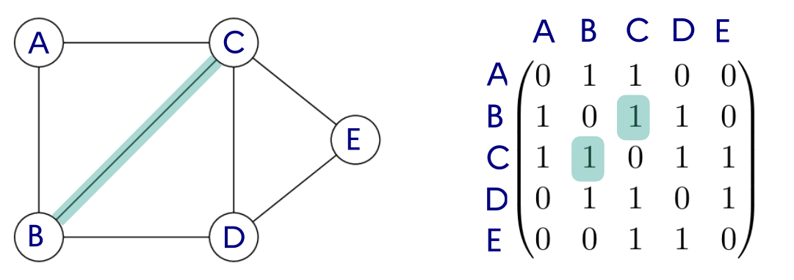
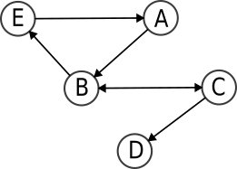
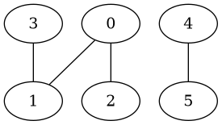
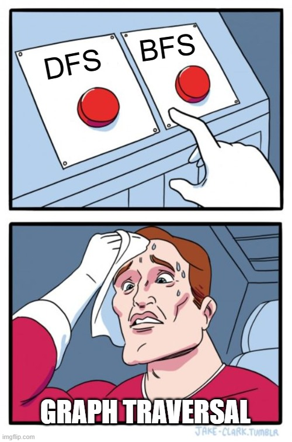

# Graphes

{: .center width=40%}


{: .center}

{: .center}

{{ initexo(0) }}

*Ce cours est intégralement inspiré du [cours de Cédric Gouygou](https://cgouygou.github.io/TNSI/T01_StructuresDonnees/T1.5_Graphes/T1.5.1_Graphes/){. target="_blank"} , du lycée Marguerite de Valois d'Angoulême (16)*

## 1. Notion de graphe et vocabulaire

Le concept de graphe permet de résoudre de nombreux problèmes en mathématiques comme en informatique. C'est un outil de représentation très courant, et nous l'avons déjà rencontré à plusieurs reprises, en particulier lors de l'étude de réseaux.


### 1.1 Exemples de situations
#### 1.1.1 Réseau informatique

{: .center width=40%} 

#### 1.1.2 Réseau de transport
{: .center width=60%} 

#### 1.1.3 Réseau social
{: .center width=40%} 

#### 1.1.4 Généralisation
Une multitude de problèmes concrets d'origines très diverses peuvent donner lieu à des modélisations par des graphes : c'est donc une structure essentielle en sciences, qui requiert un formalisme mathématique particulier que nous allons découvrir. 
{: .center} 

L'étude de la théorie des graphes est un champ très vaste des mathématiques : nous allons surtout nous intéresser à l'implémentation en Python d'un graphe et à différents problèmes algorithmiques qui se posent dans les graphes.


### 1.2 Vocabulaire
En général, un graphe est un ensemble d'objets, appelés *sommets* ou parfois *nœuds* (*vertex* or *nodes* en anglais) reliés par des *arêtes* ou *arcs* ((*edges* en anglais)).
Ce graphe peut être **non-orienté** ou **orienté** .

#### 1.2.1 Graphe non-orienté
{: .center width=480} 

Dans un graphe **non-orienté**, les *arêtes* peuvent être empruntées dans les deux sens, et une *chaîne* est une suite de sommets reliés par des arêtes, comme C - B - A - E par exemple. La *longueur* de cette chaîne est alors 3, soit le nombre d'arêtes.

Les sommets B et E sont *adjacents* au sommet A, ce sont les *voisins* de A.


**Exemple de graphe non-orienté** : le graphe des relations d'un individu sur Facebook est non-orienté, car si on est «ami» avec quelqu'un la réciproque est vraie.

#### 1.2.2 Graphe orienté

{: .center width=480} 

Dans un graphe **orienté**, les *arcs* ne peuvent être empruntés que dans le sens de la flèche, et un *chemin* est une suite de sommets reliés par des arcs, comme B → C → D → E par exemple.

Les sommets C et D sont *adjacents* au sommet B (mais pas A !), ce sont les *voisins* de B.

**Exemple de graphe orienté** : le graphe des relations d'un individu sur Twitter est orienté, car on peut «suivre» quelqu'un sans que cela soit réciproque.

#### 1.2.3 Graphe pondéré

{: .center width=480} 

Un graphe est **pondéré** (ou valué) si on attribue à chaque arête une valeur numérique (la plupart du temps positive), qu'on appelle *mesure*, *poids*, *coût* ou *valuation*.

Par exemple:

- dans le protocole OSPF, on pondère les liaisons entre routeurs par le coût;
- dans un réseau routier entre plusieurs villes, on pondère par les distances.


#### 1.2.4 Connexité

Un graphe est **connexe** s'il est d'un seul tenant: c'est-à-dire si n'importe quelle paire de sommets peut toujours être reliée par une chaîne. Autrement un graphe est connexe s'il est «en un seul morceau».

Par exemple, le graphe précédent est connexe. Mais le suivant ne l'est pas: il n'existe pas de chaîne entre les sommets A et F par exemple.

{: .center width=480} 

Il possède cependant deux **composantes connexes** : le sous-graphe composé des sommets A, B, C, D et E d'une part et le sous-graphe composé des sommets F, G et H.


## 2. Modélisations d'un graphe

Pour modéliser un graphe, il faut établir par convention une manière de donner les renseignements suivants :

- qui sont les sommets ?
- pour chaque sommet, quels sont ses voisins ? (et éventuellement quel poids porte l'arête qui les relie)


### 2.1 Représentation par matrice d'adjacence

!!! abstract "Principe"
    - On classe les sommets (en les numérotant, ou par ordre alphabétique).
    - on représente les arêtes (ou les arcs) dans une matrice, c'est-à-dire un tableau à deux dimensions où on inscrit un 1 en ligne `i` et colonne `j` si les sommets de rang `i` et de rang `j` sont **voisins** (dits aussi *adjacents*).

    Ce tableau s'appelle une **matrice d'adjacence** (on aurait très bien pu l'appeler aussi *matrice de voisinage*).


#### 2.1.1 Graphe non orienté

{: .center width=70%}


Dans ce graphe non orienté, comme B est voisin de C, C est aussi voisin de B, ce qui signifie que l'arête qui relie B et C va donner lieu à deux "1" dans la matrice, situé de part et d'autre de la diagonale descendante (un mathématicien parlera de matrice *symétrique*).


#### 2.1.2 Graphe orienté

{: .center width=70%}

Comme le graphe est orienté, la matrice n'est pas forcément symétrique (il faudrait que tous les liens soient réciproques pour qu'elle le soit).
#### 2.1.3 Graphe pondéré

{: .center width=75%}

Il peut exister de la même manière des graphes pondérés **et** orientés.

#### 2.1.4 Exercices

!!! example "{{ exercice() }}"
    Soit un ensemble d'amis connectés sur un réseau social quelconque. Voici les interactions qu'on a recensées :

    - André est ami avec Béa, Charles, Estelle et Fabrice,
    - Béa est amie avec André, Charles, Denise et Héloïse,
    - Charles est ami avec André, Béa, Denise, Estelle, Fabrice et Gilbert,
    - Denise est amie avec Béa, Charles et Estelle,
    - Estelle est amie avec André, Charles et Denise,
    - Fabrice est ami avec André, Charles et Gilbert,
    - Gilbert est ami avec Charles et Fabrice,
    - Héloïse est amie avec Béa.
    
    **Q1.** Représenter le graphe des relations dans ce réseau social (on désignera chaque individu par l'initiale de son prénom). Il est possible de faire en sorte que les arêtes ne se croisent pas !


    {{
    correction(True,
    """
    ??? success \"Correction\" 
        {: .center}    
    """
    )
    }}

        
    **Q2.** Donner la matrice d'adjacence de ce graphe.

    {{
    correction(True,
    """
    ??? success \"Correction\" 
        $\\pmatrix{
        0 & 1 & 1 & 0 & 1 & 1 & 0 & 0 \\\\
        1 & 0 & 1 & 1 & 0 & 0 & 0 & 1 \\\\
        1 & 1 & 0 & 1 & 1 & 1 & 1 & 0 \\\\
        0 & 1 & 1 & 0 & 1 & 0 & 0 & 0 \\\\
        1 & 0 & 1 & 1 & 0 & 0 & 0 & 0 \\\\
        1 & 0 & 1 & 0 & 0 & 0 & 1 & 0 \\\\
        0 & 0 & 1 & 0 & 0 & 1 & 0 & 0 \\\\
        0 & 1 & 0 & 0 & 0 & 0 & 0 & 0 \\\\
        }$        
    """
    )
    }}

        
        
!!! example "{{ exercice() }}"
    Construire les graphes correspondants aux matrices d'adjacence suivantes:

    **Q1.** $M_1 =\pmatrix{
        0&1&1&1&1\\
        1&0&1&0&0\\
        1&1&0&1&0\\
        1&0&1&0&1\\
        1&0&0&1&0\\
        }$

    {{
    correction(True,
    """
    ??? success \"Correction\" 
        {: .center} 
    """
    )
    }}
        
    **Q2.** $M_2=\pmatrix{
        0&1&1&0&1\\
        0&0&1&0&0\\
        0&0&0&1&0\\
        1&0&0&0&1\\
        0&0&0&0&0\\
        }$
    
    {{
    correction(True,
    """
    ??? success \"Correction\" 
        {: .center} 
    """
    )
    }}


        

    **Q3.** $M_3=\pmatrix{
        0&5&10&50&12\\
        5&0&10&0&0\\
        10&10&0&8&0\\
        50&0&8&0&100\\
        12&0&0&100&0\\
        }$    

    {{
    correction(True,
    """
    ??? success \"Correction\" 
        {: .center}
    """
    )
    }}

        


#### 2.1.5 Implémentation Python des matrices d'adjacence

!!! info "Matrices d'adjacence en Python"
    Une matrice se représente naturellement par une liste de listes.

    **Exemple:**
    La matrice $M_1 =\pmatrix{
        0&1&1&1&1\\
        1&0&1&0&0\\
        1&1&0&1&0\\
        1&0&1&0&1\\
        1&0&0&1&0\\
        }$, associée au graphe {: .center}

    sera représentée par la variable ```G``` suivante :

    ```python
    G = [[0, 1, 1, 1, 1],
          [1, 0, 1, 0, 0],
          [1, 1, 0, 1, 0],
          [1, 0, 1, 0, 1],
          [1, 0, 0, 1, 0]]
    ```

**Complexité en mémoire et temps d'accès :**

- Pour un graphe à $n$ sommets, la complexité en mémoire (appelée aussi *complexité spatiale*) de la représentation matricielle est en $O(n^2)$.

- Tester si un sommet est isolé (ou connaître ses voisins) est en $O(n)$ puisqu'il faut parcourir une ligne, mais tester si deux sommets sont adjacents (voisins) est en $O(1)$, c'est un simple accès au tableau.


La modélisation d'un graphe par sa matrice d'adjacence est loin d'être la seule manière de représenter un graphe : nous allons voir une autre modélisation, par **liste d'adjacence**.

### 2.2 Représentation par listes d'adjacence

!!! abstract "Principe"
    - On associe à chaque sommet sa liste des voisins (c'est-à-dire les sommets adjacents). On utilise pour cela un dictionnaire dont les clés sont les sommets et les valeurs les listes des voisins.

    - Dans le cas d'un graphe orienté on associe à chaque sommet la liste des *successeurs* (ou bien des *prédécesseurs*, au choix).

    Par exemple, le graphe {: .center} sera représenté par le dictionnaire :

    ```python linenums='1'
    G = {'A': ['B', 'C', 'D', 'E'],
         'B': ['A', 'C'],
         'C': ['A', 'B', 'D'],
         'D': ['A', 'C', 'E'],
         'E': ['A', 'D']
        }
    ```

**Complexité en mémoire et temps d'accès :**

- Pour un graphe à $n$ sommets et $m$ arêtes, la complexité spatiale de la représentation en liste d'adjacence est en $O(n+m)$. C'est beaucoup mieux qu'une matrice d'adjacence lorsque le graphe comporte peu d'arêtes (i.e. beaucoup de 0 dans la matrice, non stockés avec des listes).

- Tester si un sommet est isolé (ou connaître ses voisins) est en $O(1)$ puisqu'on y accède immédiatement, mais tester si deux sommets sont adjacents (voisins) est en $O(n)$ car il faut parcourir la liste.

#### 2.2.1 Exercices

!!! example "{{ exercice() }}"
    Construire les graphes correspondants aux listes d'adjacence suivantes.

    **Q1.** 
    ```python
    G1 = {
    'A': ['B', 'C'],
    'B': ['A', 'C', 'E', 'F'],
    'C': ['A', 'B', 'D'],
    'D': ['C', 'E'],
    'E': ['B', 'D', 'F'],
    'F': ['B', 'E']
         }
    ```

    {{
    correction(True,
    """
    ??? success \"Correction\" 
        {: .center}        
    """
    )
    }}


    **Q2.** 
    ```python
    G2 = {
    'A': ['B'],
    'B': ['C', 'E'],
    'C': ['B', 'D'],
    'D': [],
    'E': ['A']
         }

    ```

    {{
    correction(True,
    """
    ??? success \"Correction\" 
        {: .center}        
    """
    )
    }}


### 2.3 Représentation uniquement avec des listes.
{: .center}

Ainsi qu'il est fait dans le sujet [21.2](https://glassus.github.io/terminale_nsi/T6_6_Epreuve_pratique/BNS_2024/#exercice-212){. target="_blank"} de la BNS 2024, le graphe ci-dessus peut être représenté par la liste de listes suivante :

```python
adj = [[1, 2], [0, 3], [0], [1], [5], [4]]
```


## 3. Création d'une classe ```Graphe```

Dans cette partie, nous ne traiterons que des graphes **non-orientés**.

### 3.1 Interface souhaitée

Nous voulons que le graphe {: .center} puisse être créé grâce aux instructions suivantes :

```python
g = Graphe(['A', 'B', 'C', 'D', 'E'])
g.ajoute_arete('A', 'B')
g.ajoute_arete('A', 'C')
g.ajoute_arete('A', 'D')
g.ajoute_arete('A', 'E')
g.ajoute_arete('B', 'C')
g.ajoute_arete('C', 'D')
g.ajoute_arete('D', 'E')
```

Nous souhaitons aussi pouvoir tester si deux sommets sont voisins avec la méthode ```sont_voisins``` :

```python
>>> g.sont_voisins('E', 'A')
True
>>> g.sont_voisins('E', 'B')
False
```

Enfin, nous voulons pouvoir obtenir facilement la liste de tous les voisins d'un sommet avec la méthode ```voisins```:
```python
>>> g.voisins('C')
['A', 'B', 'D']
``` 

### 3.2 Conseils d'implémentation


L'objet de type ```Graphe``` aura comme attributs :

- une liste ```liste_sommets``` (donnée en paramètre dans la liste ```liste_sommets```) 
- un dictionnaire ```adjacents```, où chaque sommet se verra attribuer une liste vide ```[]```.


### 3.3 Implémentation

{#
!!! abstract "Implémentation d'une classe ```Graphe``` :heart: :heart: :heart:"
    ```python linenums='1'
    class Graphe:
        def __init__(self, liste_sommets):
            ...
            ...

        def ajoute_arete(self, sommetA, sommetB):
            ...
            ...
            
        def voisins(self, sommet):
            return ...

        def sont_voisins(self, sommetA, sommetB):
            return ...
    ```
#}


!!! abstract "Implémentation d'une classe ```Graphe``` :heart: :heart: :heart:"
    ```python linenums='1'
    class Graphe:
        def __init__(self, liste_sommets):
            self.liste_sommets = liste_sommets
            self.adjacents = {sommet : [] for sommet in liste_sommets}

        def ajoute_arete(self, sommetA, sommetB):
            self.adjacents[sommetA].append(sommetB)
            self.adjacents[sommetB].append(sommetA)
            
        def voisins(self, sommet):
            return self.adjacents[sommet]

        def sont_voisins(self, sommetA, sommetB):
            return sommetB in self.adjacents[sommetA]
    ```


## 4. :star: :star: :star: Parcours de graphes :star: :star: :star: 

{: .center width=40%} 

!!! gear "Algorithme de parcours"
    Un parcours de graphe est un algorithme consistant à explorer **tous** les sommets d'un graphe de proche
    en proche à partir d'un sommet initial. Ces parcours sont notamment utilisés pour rechercher un plus court chemin (et donc dans les GPS) ou pour trouver la sortie d'un labyrinthe...

    :warning: Parcourir simplement le dictionnaire ou la matrice d’un
    graphe n’est pas considéré comme un
    parcours de graphe. :warning:


    Tous les parcours suivent plus ou moins le même algorithme de base :

    - On visite un sommet ```A``` . On crée une structure ```S```  qui contiendra au départ uniquement le sommet ```A``` .

    - Tant que ```S``` n’est pas vide :
    
        - on choisit un sommet ```s```  de ```S``` (on dit qu'on «visite» ```s```);
        - on ajoute à ```S``` tous les voisins de ```s``` **pas encore visités**.


!!! warning "Sommets visités"
    Contrairement à un parcours d'arbre, où les fils d'un nœud ne peuvent pas avoir été visités avant le nœud, un voisin d'un sommet peut avoir déjà été visité en tant que voisin d'un sommet précédent...

    Il est donc nécessaire de mémoriser les sommets déja visités ou découverts (on dira qu'un sommet est découvert lorsqu'on l'ajoute à ```S```).


Le choix de la structure de l'ensemble ```S``` est prépondérant:

- Si on choisit une **file** (FIFO): on visitera les sommets dans l'ordre d'arrivée, donc les plus proches du sommet précédent. On obtient donc un *parcours en largeur* :arrow_right: **BFS**.
- Si on choisit une **pile** (LIFO): on visitera d'abord les derniers sommets arrivés, donc on parcourt le graphe en visitant à chaque étape un voisin du précédent. On obtient donc un *parcours en profondeur* :arrow_right: **DFS**.

{: .center width=30%} 

### 4.1 Le parcours en largeur (BFS, Breadth First Search)

#### 4.1.1 Principe

**Exemple de parcours en largeur, avec B comme sommet de départ:**

<center>
<gif-player src="https://glassus.github.io/terminale_nsi/T1_Structures_de_donnees/1.4_Graphes/data/bfs.gif" speed="1" play></gif-player>
</center>

**Codes couleur :**

- **vert** : les sommets non encore traités.
- **rouge** : le sommet en cours de traitement.
- **orange** : la file d'attente des sommets qui seront bientôt traités. On y rajoute à chaque fois les voisins du sommet en cours de traitement, uniquement **si ils n'ont pas encore été découverts**.
- **noir** : les sommets traités.

#### 4.1.2 Algorithme BFS

On utilise :

- une liste `#!py traites` qui recueille les sommets visités (c'est-à-dire qu'on a fini de traiter, après avoir ajouté ses voisins dans la file d'attente) et qui sera renvoyée à la fin de l'algorithme;
- une liste `#!py decouverts` qui contient les sommets découverts au fur et à mesure du parcours;
- une **file** `#!py en_attente` qui contient les sommets découverts mais non encore visités. On utilisera au choix une classe `File` écrite plus tôt dans l'année ou tout simplement une `#!py list` en utilisant `#!py pop(0)` (pour défiler) et `#!py append()` (pour enfiler).

En début d'algorithme, seul le sommet de départ `#!py depart` donné en paramètre est découvert. La fonction `BFS` renvoie la liste des sommets dans l'ordre de visite lors du parcours en largeur.


!!! abstract "Parcours en largeur - BFS :heart: :heart: :heart:"
    ```python linenums='1'
    def BFS(g, depart):
        '''
        Effectue un parcours en largeur du graphe g en partant du sommet depart,
        et renvoie la liste des sommets visités dans l'ordre du parcours.
        '''
        traites = []
        decouverts = [...]
        en_attente = [...]
        while ... != [] :
            sommet = ...
            voisins = ...
            for voisin in ...:
                if ... not in ...:
                    ....append(...)
                    ....append(...)
            ....append(...)
        return ...

    ```


{#
!!! abstract "Parcours en largeur - BFS :heart: :heart: :heart:"
    ```python linenums='1'
    def BFS(g, depart):
        '''
        Effectue un parcours en largeur du graphe g en partant du sommet depart,
        et renvoie la liste des sommets visités dans l'ordre du parcours.
        '''
        traites = []
        decouverts = [depart]
        en_attente = [depart]
        while en_attente != [] :
            sommet = en_attente.pop(0)
            voisins = g.voisins(sommet)
            for voisin in voisins:
                if voisin not in decouverts:
                    decouverts.append(voisin)
                    en_attente.append(voisin)
            traites.append(sommet)
        return traites

    ```
#}

!!! warning "Intérêt de la liste ```decouverts```"
    La liste ```decouverts``` contient tous les sommets qui ont été :

    - soit traités (auquel cas ils sont dans la liste ```traites```)
    - soit en attente (auquel cas ils sont dans la liste ```en_attente```)

    Le test de la ligne 13  `#!py if voisin not in decouverts:` permet donc de ne pas mettre en file d'attente un voisin qui est (ou a été) déjà en file d'attente. 

!!! warning "Que contient la file ```en_attente``` ?"
    À chaque instant, la file ```en_attente``` contient des sommets à la distance ```k+1``` et à la distance ```k``` du point de départ :

    {: .center}
     


!!! example "{{ exercice() }}"
    {: .center}

    Grâce à la classe ```Graphe``` du 3.3, ce graphe s'implémente par :

    ```python linenums='1'
    g = Graphe(['A', 'B', 'C', 'D', 'E', 'F', 'G', 'H'])
    g.ajoute_arete('A', 'B')
    g.ajoute_arete('A', 'C')
    g.ajoute_arete('B', 'D')
    g.ajoute_arete('D', 'C')
    g.ajoute_arete('B', 'E')
    g.ajoute_arete('D', 'E')
    g.ajoute_arete('E', 'F')
    g.ajoute_arete('E', 'G')
    g.ajoute_arete('F', 'G')
    g.ajoute_arete('G', 'H')
    ```
    
    **Q1.** Donner le parcours en largeur de ```g```  grâce à l'algorithme BFS, si le sommet de départ est B. Cela correspond au parcours présenté par le gif de début de paragraphe.

    {{
    correction(False,
    """
    ??? success \"Correction\" 
        ```python
        >>> BFS(g, 'B')
        ['B', 'A', 'D', 'E', 'C', 'F', 'G', 'H']
        ```        
    """
    )
    }}
  

    **Q2.** Deviner le parcours en largeur de départ D, puis de départ G. Vérifier grâce à votre algorithme.

    {{
    correction(False,
    """
    ??? success \"Correction\" 
        ```python
        >>> BFS(g, 'D')
        ['D', 'B', 'C', 'E', 'A', 'F', 'G', 'H']
        >>> BFS(g, 'G')
        ['G', 'E', 'F', 'H', 'B', 'D', 'A', 'C']
        ```        
    """
    )
    }}


    

### 4.1.3 Application du BFS : recherche du plus court chemin

L'algorithme BFS découvre les sommets «par cercles concentriques» autour du point de départ (ainsi que le montre la structure de la file d'attente). On découvre d'abord tous les sommets à la distance 1 du point de départ, puis à la distance 2, puis 3, etc.

Un sommet situé à la distance 5 sera découvert en tant que voisin d'un sommet à la distance 4, qui lui-même aura été découvert grâce à un sommet à la distance 3, qui lui-même...

On comprend donc que si on arrive à se souvenir du sommet «parent» de chaque sommet (celui qui lui a permis d'être découvert), on pourra alors reconstituer un chemin permettant de remonter au point de départ.

Nous allons pour cela nous servir d'une structure de dictionnaire pour associer à chaque sommet son sommet-parent.

Il faudra ensuite une fonction pour recréer le chemin.


!!! warning "Pourquoi le plus court chemin ?"

    - Comment est-on sûr qu'un chemin va être trouvé entre deux sommets A et B ?

    Si le graphe est connexe, tout parcours BFS au départ de A va parcourir l'intégralité du graphe, et donc passera par B à un moment. Un chemin sera donc forcément trouvé entre A et B.

    - Comment est-on sûr que ce chemin trouvé est **le plus court** ?

    La découverte des sommets par cercles concentriques entre A et B nous assure qu'on ne peut pas rater le point B : s'il est à la distance ```k``` de A, il sera forcément visité puisque tous les sommets à la distance ```k``` vont passer par la liste d'attente, après les sommets de distance ```k-1``` et avant les sommets de distance ```k+1```.
    
    Lorsqu'on remontera de B vers A en passant par les sommets parents successifs, il ne peut y avoir qu'un seul sommet par «couche» : le chemin sera donc exactement de longueur ```k```, il sera donc minimal. 


!!! abstract "Recherche du plus court chemin "

    
    ```python linenums='1'
    def recherche_chemin(g, depart, arrivee):
        '''
        Parcours en largeur du graphe g en partant du sommet depart,
        qui s'arrête dès que le sommet arrivee est atteint.
        Renvoie alors le chemin du depart vers arrivee.
        '''
        traites = []
        decouverts = [depart]
        en_attente = [depart]
        parent = {}
        while en_attente != [] :
            sommet = en_attente.pop(0)
            voisins = g.voisins(sommet)
            for voisin in voisins:
                if voisin not in decouverts:
                    decouverts.append(voisin)
                    en_attente.append(voisin)
                    parent[...] = ...
                    if voisin == arrivee:
                        return remonte_chemin(depart, arrivee, parent)
            traites.append(sommet)
        return "non trouvé"  


    def remonte_chemin(depart, arrivee, parent):
        sommet = arrivee
        chemin = arrivee
        while sommet != ...:
            sommet = parent[...]
            chemin = ... + chemin
        return chemin
    ```
    

    {#
    ```python linenums='1'
    def recherche_chemin(g, depart, arrivee):
        '''
        Parcours en largeur du graphe g en partant du sommet depart,
        qui s'arrête dès que le sommet arrivee est atteint.
        Renvoie alors le chemin du depart vers arrivee.
        '''
        traites = []
        decouverts = [depart]
        en_attente = [depart]
        parent = {}
        while en_attente != [] :
            sommet = en_attente.pop(0)
            voisins = g.voisins(sommet)
            for voisin in voisins:
                if voisin not in decouverts:
                    decouverts.append(voisin)
                    en_attente.append(voisin)
                    parent[voisin] = sommet
                    if voisin == arrivee:
                        return remonte_chemin(depart, arrivee, parent)
            traites.append(sommet)
        return "non trouvé"  


    def remonte_chemin(depart, arrivee, parent):
        sommet = arrivee
        chemin = arrivee
        while sommet != depart:
            sommet = parent[sommet]
            chemin = sommet + chemin
        return chemin
    ```
    #}


!!! example "{{ exercice() }}"
    {: .center}
    Tester le code précédent pour trouver le plus court chemin entre A et G, entre H et C, entre B et G...


### 4.2 Le parcours en profondeur (DFS, Depth First Search)

#### 4.2.1 Parcours DFS récursif


Le parcours en profondeur est un parcours où on va aller «le plus loin possible» sans se préoccuper des autres voisins non visités : on va visiter le premier de ses voisins non traités, qui va faire de même, etc. Lorsqu'il n'y a plus de voisin, on revient en arrière pour aller voir le dernier voisin non visité.

Dans un labyrinthe, ce parcours s'explique très bien : on prend tous les chemins sur la droite jusqu'à rencontrer un mur, auquel cas on revient au dernier embranchement et on prend un autre chemin, puis on repart à droite, etc.


C'est un parcours qui s'écrit naturellement de manière **récursive** :


!!! abstract "Parcours en profondeur - DFS :heart: :heart: :heart:"
    ```python linenums='1'
    def DFSrec(g, traites, actuel):
        traites.append(...)
        for voisin in ...:
            if voisin not in ...:
                ...
        return traites
    ```


{#
!!! abstract "Parcours en profondeur - DFS :heart: :heart: :heart:"
    ```python linenums='1'
    def DFSrec(g, traites, actuel):
        traites.append(actuel)
        for voisin in g.voisins(actuel):
            if voisin not in traites:
                DFSrec(g, traites, voisin)
        return traites
    ```
#}


!!! example "{{ exercice() }}"
    {: .center}
    
    **Q1.** Donner (de tête) le parcours DFS de ce graphe en partant de A.  
    Rappel : les voisins sont donnés par ordre alphabétique. Le premier voisin de A est donc B.

    **Q2.** Vérifier avec le code précédent. 

    {{
    correction(False,
    """
    ??? success \"Correction\" 
        ```python linenums='1'
        class Graphe:
            def __init__(self, liste_sommets):
                self.liste_sommets = liste_sommets
                self.adjacents = {sommet : [] for sommet in liste_sommets}

            def ajoute_arete(self, sommetA, sommetB):
                self.adjacents[sommetA].append(sommetB)
                self.adjacents[sommetB].append(sommetA)

            def voisins(self, sommet):
                return self.adjacents[sommet]

            def sont_voisins(self, sommetA, sommetB):
                return sommetB in self.adjacents[sommetA]


        g = Graphe(['A', 'B', 'C', 'D', 'E', 'F', 'G', 'H'])
        g.ajoute_arete('A', 'B')
        g.ajoute_arete('A', 'C')
        g.ajoute_arete('B', 'D')
        g.ajoute_arete('D', 'C')
        g.ajoute_arete('B', 'E')
        g.ajoute_arete('D', 'E')
        g.ajoute_arete('E', 'F')
        g.ajoute_arete('E', 'G')
        g.ajoute_arete('F', 'G')
        g.ajoute_arete('G', 'H')


        def DFSrec(g, traites, actuel):
            traites.append(actuel)
            for voisin in g.voisins(actuel):
                if voisin not in traites:
                    DFSrec(g, traites, voisin)
            return traites

        ```
    
        ```python
        >>> DFSrec(g, [], 'A')
        ['A', 'B', 'D', 'C', 'E', 'F', 'G', 'H']
        ```        
    """
    )
    }}


    **Q3.** Reprendre les questions précédentes en changeant le sommet de départ.


#### 4.2.2 Parcours DFS itératif

Il «suffit» de remplacer la file du parcours BFS par une **pile**. Ainsi, on partira visiter le voisin tout juste ajouté à la *file d'attente* (qui porte maintenant mal son nom, puisque c'est devenu une pile).

!!! abstract "Parcours en profondeur itératif - DFS "
    ```python linenums='1'
    def DFS_iteratif(graphe, start):
        traites = []
        en_attente = [start]
        while en_attente != []:
            actuel = en_attente.pop()
            if actuel not in traites:
                voisins = g.voisins(actuel)[::-1]
                for voisin in voisins:
                    if voisin not in traites:
                        en_attente.append(voisin)
                traites.append(actuel)
        return traites
    ```

**Remarques :**

- À la ligne 7, on inverse l'ordre des voisins pour que ce code renvoie le même parcours que le parcours récursif (sinon c'est le dernier voisin ajouté qui sera dépilé). Cela n'est pas obligatoire : il n'y a pas «un seul» parcours DFS (tout comme il n'y a pas qu'un seul BFS). Ce qui les caractérise est la **méthode de découverte**, plus que l'implémentation proprement dite.

- Contrairement au BFS, il est possible d'empiler un sommet déjà découvert (on vérifie juste qu'il n'ait pas déjà été traité). Vous pouvez vous en apercevoir en écrivant l'état de la pile lors du parcours DFS itératif du graphe de l'exercice 6.
