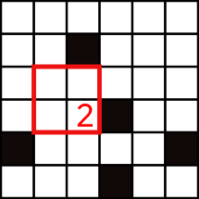
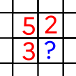

{{initexo(0)}}

# À la recherche du plus grand carré blanc
L'objectif est de trouver la taille du plus grand carré intégralement blanc que l'on peut dessiner dans l'image ci-dessous :
{: .center}

### 1. Prise en main 

!!! tip "Préambule"
    Télécharger l'image, puis creér une variable ```img``` grâce au package ```PIL```:

    ```python linenums='1'
    from PIL import Image
    img = Image.open('pgcb.bmp')
    ``` 

    On peut dès lors avoir accès à quelques informations :

    ```python
    >>> img.size
    (600, 600)
    ```
    L'image est donc de taille 600x600.

    ```python
    >>> img.getpixel((0, 0))
    (255, 255, 255)
    >>> img.getpixel((0, 358))
    (0, 0, 0)
    ```

    Le pixel de coordonnées (0, 0) est donc blanc, et le pixel (0, 358) est noir. 


!!! example "{{ exercice() }}"
    Écrire une fonction ```est_noir``` qui prend en paramètre les coordonnées d'un pixel ```x``` et ```y```   et qui renvoie ```True``` si ce pixel est noir, ```False``` sinon.

    Exemple :
    ```python
    >>> est_noir(0, 0)
    False
    >>> est_noir(0, 358)
    True
    ```

    {{
    correction(True,
    """
    ??? success \"Correction\" 
        ```python linenums='1'
        from PIL import Image
        img = Image.open('pgcb.bmp')

        def est_noir(x, y):
            return img.getpixel((x,y)) == (0, 0, 0)
        ```
    """
    )
    }}


### 1.2 Recherche manuelle

Considérons le damier ci-dessous :

{: .center}


Pour chaque case, on va inscrire à l'intérieur la taille du plus grand carré blanc possible **dont la case est le coin inférieur droit**.

Par exemple :

{: .center}

Sur une case noire, on écrira le nombre 0.

!!! example "{{ exercice() }}"
    Recopier le damier et compléter toutes les cases, **en commençant en haut à gauche**.

    {{
    correction(True,
    """
    ??? success \"Correction\" 
        {: .center}
        
    """
    )
    }}

Imaginons maintenant la situation suivante, sur un autre damier que vous ne pouvez pas voir en intégralité :

{: .center}

!!! example "{{ exercice() }}"
    Quelle est la valeur qu'il faut écrire à la place du point d'interrogation ?

    {{
    correction(True,
    """
    ??? success \"Correction\" 
        Il faut écrire la valeur 3, qui est égale à 1 + le minimum des trois cases situées au Nord, Ouest et Nord-Ouest.
    """
    )
    }}


## 2. La fonction ```pgcb```

On va écrire la fonction récursive ```pgcb```, qui prend en paramètre un tuple ```(x,y)``` et qui renvoie la taille du plus grand carré blanc dont le pixel de coordonnées ```(x,y)``` est le coin inférieur droit.

Les cas de base seront :

- le pixel est noir : on renvoie 0
- le pixel est sur la ligne du haut ou la colonne de gauche : on renvoie 1

Pour le cas général, on s'inspirera de la partie précédente...

!!! example "{{ exercice() }}"
    Écrire le code de la fonction ```pgcb```. 