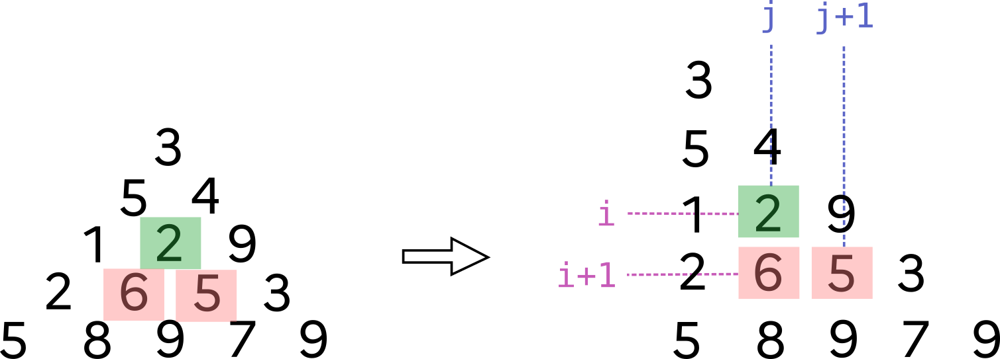
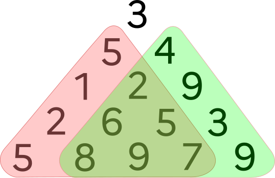
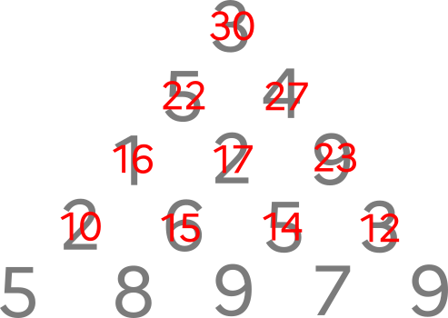

# Optimisation d'une somme dans une pyramide

!!! question "Problème"

    Considérons la pyramide ci-dessous :

    {: .center width=20%}

    En partant du sommet et en descendant jusqu'en bas en prenant soit à gauche soit à droite, quelle est la somme maximale que l'on peut obtenir ?

    {: .center width=75%}

## 1. Quelques outils

:arrow_right: La pyramide ci-dessus sera implémentée par une liste de listes :

```python
pyr_exemple = [[3], [5, 4], [1, 2, 9], [2, 6, 5, 3], [5, 8, 9, 7, 9]]
```

:arrow_right: Pour générer une pyramide de hauteur ```n``` (composée d'entiers aléatoires entre 0 et 9) :

```python linenums='1'
from random import randint

def genere_pyr(n):
    pyr = []
    for k in range(1, n+1):
        lst = [randint(0,9) for _ in range(k)]
        pyr.append(lst)
    return pyr
```

:arrow_right: Pour afficher une pyramide en console :
```python linenums='1'
def affiche(pyr):
    for lst in pyr:
        print(" "*(len(pyr)-len(lst)) + " ".join(str(k) for k in lst))
```

{{initexo(0)}}

!!! example "{{ exercice() }}"
    Créer puis afficher une pyramide de hauteur 10.

    {{
    correction(True,
    """
    ??? success \"Correction\" 
        ```python
        >>> pyr = genere_pyr(10)
        >>> affiche(pyr)
                 9
                9 2
               8 1 7
              4 0 4 0
             3 4 5 7 8
            4 4 7 5 8 4
           7 8 1 6 0 6 0
          4 3 2 0 8 2 5 8
         6 0 7 9 0 9 9 0 8
        3 1 7 9 2 6 9 6 5 9                    
        ```
    """
    )
    }}

## 2. Recherche par force brute

### 2.1 Liste de tous les parcours

La fonction ```liste_parcours```  ci-dessous renvoie la liste de tous les trajets possibles lors de la traversée de la pyramide ```pyr```. Ces parcours contiennent les **indices** des valeurs traversées lors du parcours.

```python linenums='1'
def liste_parcours(pyr):
    file = [[0]]
    parcours = []
    while file:
        trajet = file.pop(0)
        j = trajet[-1]
        trajet_left = trajet[::]
        trajet_right = trajet[::]
        niv = len(trajet)
        trajet_left.append(j)
        trajet_right.append(j+1)
        if len(trajet_left) == len(pyr):
            parcours.append(trajet_left)
        else:
            file.append(trajet_left)
        if len(trajet_right) == len(pyr):
            parcours.append(trajet_right)
        else:
            file.append(trajet_right)
    return parcours
```

!!! example "{{ exercice() }}"
    1. Observez la liste des trajets pour la pyramide ```pyr_exemple``` pour en comprendre la notation.
    2. Pour une pyramide de hauteur $n$, combien y a-t-il de trajets différents ? 
    3. Pour une pyramide de hauteur 41, que pensez-vous du nombre de trajets différents ?

    {{
    correction(True,
    """
    ??? success \"Correction\" 
        Le nombre de trajets pour une hauteur $n$ est $2^{n-1}$.

        Pour une pyramide de hauteur 41, cela donne $2^{40}$, soit plus de mille milliards de chemins possibles...
    """
    )
    }}


### 2.2 Valeur d'un trajet

!!! example "{{ exercice() }}"
    Écrire une fonction ```val_trajet``` qui prend en paramètres un trajet ```trajet``` et une pyramide ```pyr``` et qui renvoie la somme finale à l'issue de ce trajet.

    Exemple :
    ```python
    >>> val_trajet([0, 1, 1, 2, 2], pyr_exemple)
    23
    ```

    {{
    correction(True,
    """
    ??? success \"Correction\" 
        ```python linenums='1'
        def val_trajet(trajet, pyr):
            s = 0
            for i in range(len(trajet)):
                s += pyr[i][trajet[i]]
            return s
        ``` 
    """
    )
    }}

### 2.3 Somme maximale par force brute

!!! example "{{ exercice() }}"
    **Q1.** Écrire une fonction ```max_force_brute``` qui prend en paramètre une pyramide ```pyr``` et qui renvoie la somme maximale parmi tous les trajets possibles.

    {{
    correction(False,
    """
    ??? success \"Correction\" 
        ```python linenums='1'
        def max_force_brute(pyr):
            trajets = liste_parcours(pyr)
            m = 0
            for tr in trajets:
                v = val_trajet(tr, pyr)
                if v > m:
                    m = v
            return m
        ```
    """
    )
    }}

    **Q2.** Testez votre algorithme avec ```pyr_exemple```, ainsi qu'avec des pyramides de taille supérieure. Que se passe-t-il ?

    {{
    correction(False,
    """
    ??? success \"Correction\" 
        Notre algorithme donne bien la bonne solution pour ```pyr_exemple```, mais dès que la taille de la pyramide augmente, le temps d'exécution devient beaucoup trop long et notre programme inutilisable.
    """
    )
    }}

## 3. Recherche par méthode gloutonne

Notre algorithme de force brute n'étant pas utilisable, il va falloir essayer d'être plus efficace. Pourquoi ne pas chercher une méthode [gloutonne](https://glassus.github.io/premiere_nsi/T4_Algorithmique/4.6_Algorithmes_gloutons/cours/){. target="_blank"} ?

*Rappel :*  lors du parcours d'une pyramide, les deux cases sous la case ```[i][j]``` sont la case ```[i+1][j]``` et ```[i+1][j+1]```.

{: .center width=60%}


!!! example "{{ exercice() }}"
    **Q1.** Compléter la fonction ```max_glouton``` ci-dessous qui calcule de manière gloutonne le «meilleur» trajet d'une pyramide ```pyr```. 

    ```python linenums='1'
    def max_glouton(pyr):
        s = pyr[0][0]
        j = 0
        for i in range(..., ...):
            v1 = ...
            v2 = ...
            if ... > ...:
                ... += ...
            else:
                ... += ...
                j = ...
        return s
    ```
  
    {{
    correction(False,
    """
    ??? success \"Correction\" 
        ```python linenums='1'
        def max_glouton(pyr):
            s = pyr[0][0]
            j = 0
            for i in range(1, len(pyr)):
                v1 = pyr[i][j]
                v2 = pyr[i][j + 1]
                if v1 > v2:
                    s += v1
                else:
                    s += v2
                    j = j + 1
            return s
        ```
    """
    )
    }}

    **Q2.** Observer et analyser le résultat donné par notre algorithme sur ```pyr_exemple```.

    {{
    correction(False,
    """
    ??? success \"Correction\" 
        Notre algorithme renvoie 25 au lieu de 30. Il ne nous donne donc pas le meilleur résultat.

        Cela ne doit pas nous étonner, car la succession de meilleurs choix locaux ne donne pas forcément le meilleur choix global.
    """
    )
    }} 

## 4. Recherche par méthode récursive

!!! example "{{ exercice() }}"
    
    Observer le dessin suivant :
    {: .center width=30%}

    **Q1.** En déduire une fonction ```max_recursif``` qui prendra en paramètre une pyramide ```pyr``` et qui calculera de manière récursive la somme maximale.

    Pour extraire les deux sous-pyramides gauche et droite, on pourra utiliser le code suivant :

    ```python linenums='1'
    def extract_sub_left_right(pyr):
        left = []
        right = []
        for k in range(1, len(pyr)):
            lst_left = [pyr[k][j] for j in range(k)]
            lst_right = [pyr[k][j+1] for j in range(k)]
            left.append(lst_left)
            right.append(lst_right)
        return left, right
    ```
    
    {{
    correction(False,
    """
    ??? success \"Correction\" 
        ```python linenums='1'
        def max_recursif(pyr):
            if len(pyr) == 1:
                return pyr[0][0]
            pyr_left, pyr_right = extract_sub_left_right(pyr)
            return pyr[0][0] + max(max_recursif(pyr_left), max_recursif(pyr_right))
        ```
    """
    )
    }}

    **Q2.** Testez votre algorithme avec ```pyr_exemple```, ainsi qu'avec des pyramides de taille supérieure. Que se passe-t-il ?

    {{
    correction(False,
    """
    ??? success \"Correction\" 
        Dès que la hauteur de la pyramide dépasse 25 (environ) le programme devient extrêmement lent et inutilisable. On retrouve le problème rencontré avec l'algorithme de force brute.
    """
    )
    }}


## 5. Optimisation de la méthode récursive par programmation dynamique

La lenteur de l'algorithme précédent vient du fait que certains calculs sont redondants. 

{: .center width=30%}

Par exemple, le calcul du maximum de la pyramide rouge sera lancé en tant que sous-pyramide droite de la valeur 5, et en tant que sous-pyramide gauche de la valeur 4.

Si la pyramide initiale est grande, ces appels inutiles vont se multiplier et ralentir considérablement l'exécution du programme.

!!! example "{{ exercice() }}"
    Dans le code récursif suivant, chaque pyramide est identifiée par les coordonnées de son sommet, stockées dans le tuple ```pos``` .

    Pour chaque sommet de coordonnées ```(i, j)```, il y a aura donc un appel récursif pour calculer la somme maximale de la pyramide de sommet ```(i+1, j)``` et celle de sommet ```(i, j+1)```.

    Ce sont ces calculs que l'on doit stocker pour éviter d'avoir à les refaire (principe de **mémoïsation**).

    On va donc utiliser un dictionnaire ```dict_max``` qui associera à chaque sommet ```(i, j)``` la somme maximale de sa pyramide.

    **Q1.** Compléter le code suivant :

    ```python linenums='1'
    dict_max = {}
    def max_rec_dynamique(pyr, pos=(0,0)):
        i, j = pos
        if i == len(pyr) - 1:
            return pyr[...][...]
        
        # calcul du max de la sous-pyramide gauche
        if (..., ...) in dict_max:
            val_gauche = ...
        else:
            val_gauche = ...
            dict_max[...] = ...
            
        # calcul du max de la sous-pyramide droite
        ...
        ...
        ...
        ...
        ...
            
        return ... + ...
    ```

    {{
    correction(False,
    """
    ??? success \"Correction\" 
        ```python linenums='1'
        dict_max = {}
        def max_rec_dynamique(pyr, pos=(0,0)):
            i, j = pos
            if i == len(pyr) - 1:
                return pyr[i][j]
            
            if (i+1, j) in dict_max:
                val_gauche = dict_max[(i+1, j)]
            else:
                val_gauche = max_rec_dynamique(pyr, (i+1, j))
                dict_max[(i+1, j)] = val_gauche
                
            if (i+1, j+1) in dict_max:
                val_droit = dict_max[(i+1, j+1)]
            else:
                val_droit = max_rec_dynamique(pyr, (i+1, j+1))
                dict_max[(i+1, j+1)] = val_droit
                
            return pyr[i][j] + max(val_gauche, val_droit)
        ```
    """
    )
    }}

    **Q2.** Testez votre algorithme avec ```pyr_exemple```, ainsi qu'avec des pyramides de taille supérieure. Que constatez-vous ?

    {{
    correction(False,
    """
    ??? success \"Correction\" 
        On constate que notre algorithme est devenu quasi-instantané. Il ne faut que quelques secondes pour faire trouver le maximum d'une pyramide de taille 500.
    """
    )
    }}


## 6. Méthode bottom-up

!!! note "Plus court chemin"
    {: .center}

    Dans la figure ci-dessus, le chemin surligné est le chemin de longueur minimale entre A et C. 

    Ce chemin passe par B. 

    On peut donc en déduire que la portion de ce chemin entre B et C (portion rouge) est le chemin minimal entre B et C.

    > On peut le démontrer facilement *par l'absurde* : si le chemin rouge n'est pas le chemin minimal entre B et C, alors il en existe un autre qui est minimal (par exemple le violet). En emprutant ce chemin à partir de B, on pourrait donc construire entre A et C un chemin plus court que le chemin surligné, ce qui est impossible.

    De manière analogue, on peut affirmer ceci : si le chemin minimal passe par B, alors la portion de ce chemin minimal entre B et C est forcément le chemin rouge.

Nous allons exploiter une idée similaire pour maximiser le parcours dans notre pyramide.

{: .center width=25%}


Admettons que le parcours maximal passe par la valeur 6. Ensuite, ce parcours doit passer par 8 ou par 9. Comme ce parcours est maximal, il passera forcément par 9.

On peut donc en déduire que si le parcours arrive à cette valeur 6, alors cette valeur pourrait être remplacée par 15.

Faisons de même pour les autres valeurs de l'avant-dernière ligne :

{: .center width=25%}

En procédant de même pour les lignes supérieures, on trouve la valeur maximale de 30 :

{: .center width=25%}

!!! example "{{ exercice() }}"
    En s'inspirant de la méthode précédente, écrire une fonction ```max_iteratif``` qui prend une pyramide ```pyr``` en paramètre et qui renvoie la somme maximale des parcours de cette pyramide.

    Effectuer des tests pour apprécier l'efficacité de cette fonction.

    {{
    correction(False,
    """
    ??? success \"Correction\" 
        ```python linenums='1'
        def max_iteratif(pyr):
            for i in range(len(pyr)-2, -1, -1):
                for j in range(len(pyr[i])):
                    pyr[i][j] = pyr[i][j] + max(pyr[i+1][j], pyr[i+1][j+1])
            return pyr[0][0]
        ```
        On peut calculer que cet algorithme est de complexité quadratique. Il reste néanmoins très rapide, y compris pour des grandes pyramides.
    """
    )
    }}

