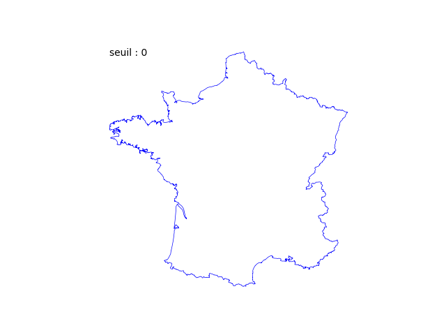
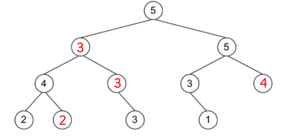

# Correction du sujet 22-NSIJ2AS1 / Amérique du Sud J2 2022

:arrow_right: [Sujet](../../data/2022/2022_Amerique_Sud_J2.pdf){. target="_blank"}

## Exercice 1

??? tip "Correction Q1"
    ```python linenums='1' hl_lines='6 7 8'
    def plus_proche_voisin(t, cible) :
        dmin = distance(t[0], cible)
        idx_ppv = 0
        n = len(t)
        for idx in range(1, n) :
            if distance(t[idx], cible) < dmin:
                dmin = distance(t[idx], cible)
                idx_ppv = idx
        return idx_ppv
    ```

??? tip "Correction Q2"
    La complexité est linéaire, car le nombre d'opérations est proportionnel à la taille du tableau ```t```.

??? tip "Correction Q3.a"
    Il suffit d'insérer la ligne ```dist = distance(obj, cible)``` en dessous de la boucle ```for``` et d'utiliser cette variable ```dist``` partout à la place de ```distance(obj, cible)```.

??? tip "Correction Q3.b"
    La complexité (même répétée) d'une opération d'insertion d'un seul élément à sa bonne place dans une liste est moindre que celle d'un tri global. (NDLR : pas sûr)

??? tip "Correction Q3.c"
    ```python linenums='1'
    def insertion(kppv, idx, d):
        i = 0
        while d < kppv[i][1] and i < len(kppv):
            i += 1
        kppv.insert(i, (idx, d)) 
    ```


## Exercice 2

### Partie A

??? tip "Correction Q1"
    ```ifconfig``` 

??? tip "Correction Q2"
    ```DHCP``` (NDLR : question hors-programme)

??? tip "Correction Q3"
    ```192.168.1.1``` 

??? tip "Correction Q4"
    C’est possible et cette adresse serait celle de la box vers Internet. 

??? tip "Correction Q5"
    Oui, car les adresses 192.168.x.x ne sont pas routées sur Internet. 

### Partie B

??? tip "Correction Q1"
    $C = \dfrac{10^9}{50 \times 10^6}=\dfrac{1000}{50}=20$

??? tip "Correction Q2.a."
    {: .center}

??? tip "Correction Q2.b."
    Suivant le protocole OSPF, il faut minimiser le coût total. Il faut pour cela suivre le chemin R1-R3-R6-R7-R4-R5-R8, pour un coût total de 80.

??? tip "Correction Q3.c."
    Pour que le protocole OSPF fasse passer par la liaison R1-R4, il faut que celle-ci ait un coût inférieur à la liaison actuelle R1-R3-R6-R7-R4, qui a un coût de 40.  
    Il faut donc que le coût R1-R4 soit inférieur à 40, ce qui sera le cas pour une bande passante supérieure à 25 Mb/s (car $\dfrac{10^9}{25 \times 10^6}=40$)
    
    
## Exercice 3

??? tip "Correction Q1"
    ```sql
    UPDATE ModeleVelo
    SET Stock = 0
    WHERE nomModele = "Bovelo";
    ```

??? tip "Correction Q2"
    Il faut effectuer d'abord la requête 4 (qui déclare le nouveau fabricant, qui aura pour ```idFabricant``` 3127), puis la requête 2 (où on peut retrouver l'id 3127).

??? tip "Correction Q3.a."
    ```sql
    SELECT nomModele, idFabricant
    FROM ModeleVelo
    WHERE Stock = 0;
    ```

??? tip "Correction Q3.b."
    ```sql
    SELECT COUNT(numeroCommande)
    FROM Commande
    WHERE date >= '2022-01-01';
    ```

??? tip "Correction Q3.c."
    ```sql
    SELECT Fabricant.nom
    FROM Fabricant
    JOIN ModeleVelo ON Fabricant.idFabricant = ModeleVelo.idFabricant
    WHERE ModeleVelo.Stock > 0
    ```

??? tip "Correction Q4."
    Cette requête permet d'obtenir le nom de tous les clients ayant acheté le modèle de vélo "Bovelo". Si certains l'ont acheté en plusieurs exemplaires, leur nom n'apparaitra qu'une seule fois.

## Exercice 4

??? tip "Correction Q1.a."
    ```python
    from math import sqrt
    ```

??? tip "Correction Q1.b."
    ```python linenums='1'
    def distance_points(a, b):
        return sqrt((b[0]-a[0])**2 + (b[1]-a[1])**2)
    ```
    
??? tip "Correction Q2."
    ```python linenums='1'
    def distance(p, a, b):
        if a == b:
            return distance_points(p, a)
        else:
            return distance_point_droite(p, a, b)
    ```

??? tip "Correction Q3."
    ```python linenums='1' hl_lines='8 10-13'
    def le_plus_loin(ligne):
        n = len(ligne)
        deb = ligne[0]
        fin = ligne[n-1]
        dmax = 0
        indice_max = 0
        for idx in range(1, n-1):
            p = ligne[idx]
            d = distance(p, deb, fin)
            if d > dmax:
                dmax = d
                indice_max = idx
        return (indice_max, dmax)
    ```

??? tip "Correction Q4."
    ```python linenums='1'
    def extrait(tab, i, j):
        ext = []
        for k in range(i, j+1):
            ext.append(tab[k])
        return ext
    ```

??? tip "Correction Q5."
    ```python linenums='1'
    def simplifie(ligne, seuil):
        n = len(ligne)
        if n <= 2:
            return ligne
        else:
            indice_max, dmax = le_plus_loin(ligne)
            if dmax <= seuil:
                return [ligne[0], ligne[n-1]]
            else:
                return simplifie(extrait(ligne, 0, indice_max), seuil) + \
                    simplifie(extrait(ligne, indice_max+1, n-1), seuil)
    ```


## Mise en pratique de l'algorithme de Douglas-Peucker (exercice 4)

Téléchargez d'abord le fichier [coord_france.txt](data/coord_france.txt) puis placez-le dans le même dossier que le code Python ci-dessous :


```python linenums='1'
from math import sqrt
import matplotlib.pyplot as plt

data = open('coord_france.txt').read().splitlines()
france = []
for couple in data:
    cpl = couple.split(',')
    france.append((int(cpl[0]), int(cpl[1])))

def distance_points(a, b):
    return sqrt((b[0]-a[0])**2 + (b[1]-a[1])**2)

def distance_point_droite(p, a, b):
    if b[0] == a[0]:
        return abs(p[0]-a[0])
    m = (b[1] - a[1]) / (b[0] - a[0])
    od = a[1] - m*a[0]
    xm = (p[0]*(b[0]-a[0])+(p[1]-od)*(b[1]-a[1])) / (b[0]-a[0] + m*(b[1]-a[1]))
    ym = m*xm + od
    return distance_points(p, (xm, ym))  

def distance(p, a, b):
    if a == b:
        return distance_points(p, a)
    else:
        return distance_point_droite(p, a, b)
    
def le_plus_loin(ligne):
    n = len(ligne)
    deb = ligne[0]
    fin = ligne[n-1]
    dmax = 0
    indice_max = 0
    for idx in range(1, n-1):
        p = ligne[idx]
        d = distance(p, deb, fin)
        if d > dmax:
            dmax = d
            indice_max = idx
    return (indice_max, dmax)


def extrait(tab, i, j):
    ext = []
    for k in range(i, j+1):
        ext.append(tab[k])
    return ext

def simplifie(ligne, seuil):
    n = len(ligne)
    if n <= 2:
        return ligne
    else:
        indice_max, dmax = le_plus_loin(ligne)
        if dmax <= seuil:
            return [ligne[0], ligne[n-1]]
        else:
            return simplifie(extrait(ligne, 0, indice_max), seuil) + \
                   simplifie(extrait(ligne, indice_max+1, n-1), seuil)


def trace(ligne, seuil):
    new_ligne = simplifie(ligne, seuil)
    x = [p[0] for p in new_ligne]
    y = [p[1] for p in new_ligne]
    plt.plot(x, y, 'b-', linewidth=0.5)
    plt.text(195014, 2865745, 'seuil : ' + str(seuil))
    plt.axis('equal')
    plt.axis('off')
    plt.show()

trace(france, 0)
```

Le rendu avec un seuil égal à 0 est celui-ci :

{: .center}

Vous pouvez faire varier le seuil entre 0 et 5000 et observer les modifications.


## Exercice 5

??? tip "Correction Q1"
    La plus grande somme est 16, via la branche 2-7-4-3.

??? tip "Correction Q2.a."
    ```python
    a = Noeud(2)
    a.modifier_sag(Noeud(7))
    a.modifier_sad(Noeud(5))
    a.sag.modifier_sag(Noeud(4))
    a.sag.modifier_sad(Noeud(1))
    a.sad.modifier_sad(Noeud(8))
    ```

??? tip "Correction Q2.b."
    La méthode ```niveau``` renvoie 2 (qui est la hauteur de cet arbre, en prenant la convention que l'arbre réduit à son nœud-racine a une hauteur de 0).
    
??? tip "Correction Q3."
    ```python linenums='1'
    def pgde_somme(self):
        if self.sag != None and self.sad != None:
            pgde_g = self.sag.pgde_somme()
            pgde_d = self.sad.pgde_somme()
            return self.etiquette + max(pgde_g, pgde_d)

        if self.sag != None:
            return self.sag.pgde_somme() + self.etiquette
        if self.sad != None:
            return self.sad.pgde_somme() + self.etiquette
        return self.etiquette   
    ```
    
??? tip "Correction Q4.a."
    {: .center}
    
??? tip "Correction Q4.b."
    ```python linenums='1'
    def est_magique(self):
        if self.sag != None and self.sad != None:
            return self.sag.est_magique() and self.sad.est_magique() \
                and self.sag.pgde_somme() == self.sad.pgde_somme()
        if self.sag != None:
            return self.sag.est_magique()
        if self.sad != None:
            return self.sad.est_magique()
        return True   
    ```
    
    