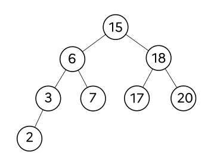
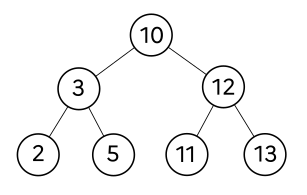

# Correction du sujet 0 version B / 2023

:arrow_right: [Sujet](../../data/2023/2023-sujet_0-b.pdf){. target="_blank"}

## Exercice 1

??? tip "correction Q1.a."
    Commande 1 : ```cd /home/documents/collections/timbres``` (chemin absolu)  
    Commande 2 : ```cd ../collections/timbres``` (chemin relatif)

??? tip "correction Q1.b."
    ```cd /home/documents/collections/timbres```

??? tip "correction Q2.a."
    $C = \dfrac{10^8}{100 \times 10^6} = 1$

??? tip "Correction Q2.b."
    {: .center}
    La route minimale est donc A-B-C-E-F-G (coût total de 1,04)

??? tip "Correction Q3."
    Les descripteurs de ce fichier sont :
    
    - `nom_timbre` (valeurs associées : `Gustave Eiffel`, ```Marianne```, ```Alan Turing```)
    - ```annee_fabrication``` (valeurs associées : ```1950```, ```1989```, ```2012```)
    - ```nom_collectionneur``` (valeurs associées : ```Dupont```, ```Durand```)

??? tip "Correction Q4.a."
    Une clé primaire est attribut qui désigne de manière unique un enregistrement.

??? tip "Correction Q4.b."
    Non, car deux enregistrements possèdent le nom «Gustave Eiffel».

??? tip "Correction Q4.c."
    Non, car deux enregistrements ont été fabriqués en 1989. *(merci Vincent)*
   

??? tip "Correction Q4.d."
    On peut créer une clé primaire artificielle (un nombre entier), ou bien considérer le couple (```nom```, ```annee_fabrication```) comme clé primaire.
    

??? tip "Correction Q5.a."
    Cette requête va modifier l'attribut ```ref_licence``` de Jean-Pierre Dupond ET de Alexandra, qui auront donc la même référence de licence ```'Ythpswz'```.

??? tip "Correction Q5.b."
    L'attribut ```ref_licence``` ne peut plus être une clé primaire car deux enregistrements différents auront la même valeur pour cet attribut.

??? tip "Correction Q6."
    ```sql
    SELECT nom, prenom, nbre_timbres
    FROM collectionneurs
    WHERE annee_naissance >= 1963;
    ```
    
## Exercice 2

??? tip "Correction Q1.a."
    Une fonction récursive est une fonction qui fait appel à elle-même dans sa propre définition.

??? tip "Correction Q1.b."
    Lors du premier appel de la fonction, le paramètre ```n``` vaut 3. Lors des appels récursifs, ce paramètre va décroître à 2, 1 puis 0 puisque l'appel se fait sous condition que ```n >= 0```. Le dernier appel se fait avec la valeur ```n = -1```. Lors de l'exécution de ```compte_rebours(n-1)```, rien ne se passe. La dernière valeur affichée est donc 0.   
    
??? tip "Correction Q2."
    ```python linenums='1'
    def fact(n):
        """ renvoie le produit des nombres entiers
        strictement positifs inférieurs à n """
        if n == 0:
            return 1
        else:
            return n * fact(n-1)
    ```
    
??? tip "Correction Q3.a."
    L'affichage en console sera :
    ```python
    3
    2
    1
    ```
??? tip "Correction Q3.b."
    La variable ```res``` contiendra la valeur 6.

??? tip "Correction Q4."
    ```python linenums='1'
    def somme_entiers(n):
        somme = 0
        for nb in range(n+1):
            somme += nb
        return somme
    ```
    
    
## Exercice 3

??? tip "Correction Q1.a."
    Exemple d'attribut : ```valeur```  
    Exemple de méthode : ```get_valeur```

??? tip "Correction Q1.b"
    Après exécution, ```a``` vaut 15 et ```b``` vaut 6. 

??? tip "Correction Q2."
    {: .center}

??? tip "Correction Q3."
    Ce n'est pas un ABR car la valeur 13 est censée être plus petite que la valeur 12.
    {: .center}
    
??? tip "Correction Q4."
    La liste renvoyée est ```[1, 6, 10, 15, 16, 18, 16, 25]```. 
    
     
    
    

