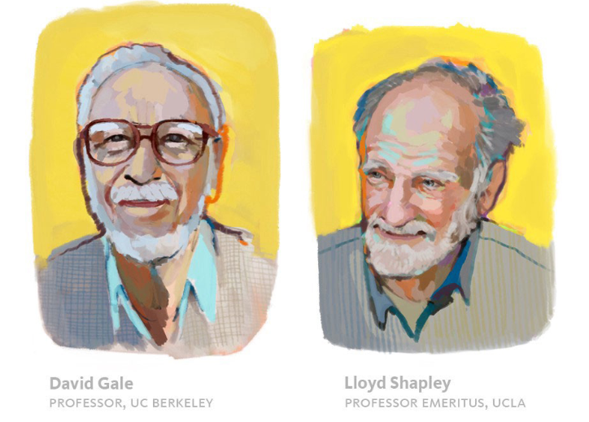

# Gale-Shapley et l'algorithme de Parcoursup

L'affectation des élèves dans l'enseignement supérieur (par l'algorithme APB jusqu'en 2020, par l'algorithme Parcoursup depuis) fait intervenir un algorithme *d'appariement*. Il s'agit d'associer, de la meilleure manière possible, les élèves à leur formation préférée.

!!! quote "Appariement" 
    *Action d'apparier, d'unir par couple, d'assortir par paire.*

Considérons que les élèves aient fait un classement de leurs formations préférées (**ce n'est pas le cas dans Parcoursup**, nous y reviendrons). Considérons aussi que ces formations aient classé ces élèves au vu de leur dossier. L'algorithme d'appariement va avoir pour but d'associer chaque élève à une formation, sans qu'un élève ait pris la place d'un autre tout en étant moins bien classé que lui.

## 1. Algorithmes d'appariement

*TODO*

### 1.1 Notion de mariages instables

!!! tip "Mariages instables"
    Deux mariages sont dits **instables** si, dans chacun des deux couples, il existe la possibilité de quitter son conjoint actuel pour quelqu'un mieux classé dans ses préférences.

!!! note "Exemple de mariage instable"
    Considérons 4 personnes : 2 hommes (Bryce, Gregory) et 2 femmes (Trinity et Riley).

    On leur a demandé de classer les deux personnes du sexe opposé par ordre de préférence. Voilà le résultat :
    
    {: .center width=60%}

    Bryce préfère Riley à Trinity, Gregory préfère Riley à Trinity, Trinity préfère Bryce à Gregory, Riley préfère Bryce à Gregory.

    Considérons maintenant qu'un algorithme d'appariement a formé les couples suivants : Bryce-Trinity et Gregory-Riley.
    

    {: .center width=40%}
    
    Mais alors :

    - Bryce est avec Trinity alors qu'il préfère Riley.
    - Riley est avec Gregory alors qu'elle préfère Byrce.

    :arrow_right: le couple Bryce-Riley crée donc deux mariages **instables**, car leur intérêt est de briser leur couple actuel et de partir ensemble.

    Par abus de langage, on pourra dire que le couple Bryce-Riley est un couple instable (car leurs mariages respectifs sont instables).

    {: .center width=40%}

!!! abstract "Exercice 1"
    La configuration ci-dessous contient-elle des mariages instables ?

    {: .center}

    {{
    correction(True,
    """
    ??? success \"Correction\" 
        Le couple Christopher-Evelyn est un couple instable.
    """
    )
    }}

!!! abstract "Exercice 2"
    À l'adresse [https://uw-cse442-wi20.github.io/FP-cs-algorithm/](https://uw-cse442-wi20.github.io/FP-cs-algorithm/){. target="_blank"}, allez jusqu'à la zone «Identify Unstable Pairs» et entraînez-vous à repérer les mariages instables.

1.2 Notion de mariage stable

!!! tip "Mariages stables"
    Un ensemble de mariages sera dit **stable** s'il n'existe aucun couple instable parmi tous les mariages.

    {: .center}

    La situation ci-dessus est stable, car aucun couple n'est instable.
    

Le travail des algorithmes d'appariement va être d'essayerd d'arriver à une situation stable.

L'algorithme le plus connu est l'algorithme de Gale-Shapley

## 2. Algorithme de Gale-Shapley

{: .center width=40%}

David Gale (1921-2008) et Lloyd Shapley (1923-2016), deux universitaires américains, ont présenté en 1962 un algorithme d'appariement qui porte leur nom. ([lien vers la publication originale](https://www.eecs.harvard.edu/cs286r/courses/fall09/papers/galeshapley.pdf){. target="_blank"})

!!! tip "Algorithme de Gale-Shapley :heart: :heart: :heart:"
    - Tant qu'il existe un homme n'ayant pas trouvé de femme :
        - chaque homme libre se propose à la femme de son classement la mieux classée parmi celles à qui il n'a pas encore proposé.
        - si la femme est libre, elle accepte.
        - si elle n'est pas libre mais que l'homme qui vient de lui faire une proposition est mieux classé que son mari actuel, elle brise son couple actuel et accepte la proposition qui vient de lui être faite.

